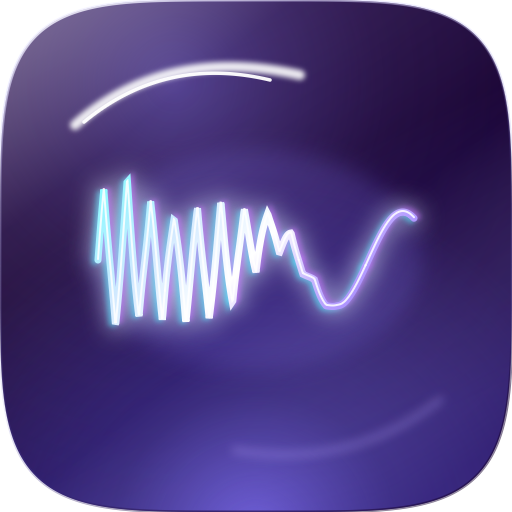
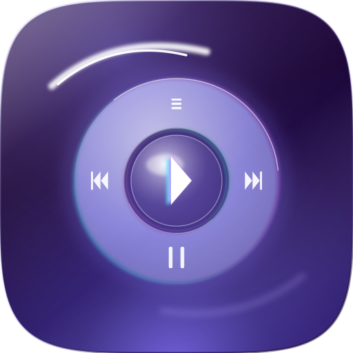

# iPod Music Manager

A native macOS app for converting your self-hosted [Navidrome](https://www.navidrome.org/) FLAC library into Apple Music — with full metadata, artwork, and automatic playlist sync.

---

## App Icons

<p align="center">
  
  &nbsp;&nbsp;&nbsp;&nbsp;
  
</p>
<p align="center">
  <sub>Waveform (default) &nbsp;&nbsp;&nbsp;&nbsp;&nbsp;&nbsp;&nbsp;&nbsp;&nbsp;&nbsp;&nbsp;&nbsp;&nbsp;&nbsp; ClickWheel</sub>
</p>

Switch icons in **Settings → General → App Icon**.

---

## Features

| | |
|---|---|
| **Navidrome browser** | Browse artists → albums → tracks with artwork, direct from your server |
| **Format & quality choice** | Output AAC, Apple Lossless (ALAC), MP3, or FLAC — with Maximum/High/Medium/Low (320/256/192/128 kbps) tiers for lossy formats, and an album-art embedding toggle |
| **FLAC conversion pipeline** | ffmpeg + Apple's `afconvert` (AAC) with full metadata/artwork injection; verifies each track actually lands in Apple Music |
| **Zero-copy import** | Every temp file is deleted the moment the track lands in Apple Music |
| **Linked playlist sync** | Mirror any Navidrome playlist to Apple Music — additions and removals — on a configurable timer; reconciles membership every sync |
| **Library-only links** | Optionally import a playlist's songs into the library with no Apple Music playlist (reach the iPod via whole-library sync) |
| **Re-process library** | Re-apply new format/quality/art settings to already-imported tracks; art-only changes update in place, format/quality changes safely re-convert and replace |
| **Local FLAC drop** | Drag files or folders straight into the app as an alternative to browsing |
| **Queue panel** | Per-track progress: downloading → converting → importing |
| **History** | Log of every completed or failed conversion in the current session |

> **Note on Apple Music & the iPod:** Apple Music can't import FLAC — choose **Apple Lossless** for lossless. A classic iPod mini plays ALAC only up to 16-bit/48 kHz, so keep hi-res in Apple Music and enable Finder's "Convert higher bit rate songs to 256 kbps AAC" when syncing the iPod.

---

## Requirements

- macOS 14 Ventura or later
- [ffmpeg](https://formulae.brew.sh/formula/ffmpeg): `brew install ffmpeg`
- A running [Navidrome](https://www.navidrome.org/) instance (any version with Subsonic API)

---

## Installation

1. Download `iPod-Music-Manager-vX.X.zip` from [Releases](../../releases)
2. Unzip and drag **iPod Music Manager.app** to `/Applications`
3. Open the app → **Settings (⌘,)** → enter your Navidrome URL + credentials → **Save & Test**

---

## Building from source

```bash
# Prerequisites: Xcode 15+, xcodegen
brew install xcodegen

git clone https://github.com/SahilUX/iPod-Music-Manager
cd iPod-Music-Manager
xcodegen generate
open iPodMusicManager.xcodeproj
```

Set your **Team** in Signing & Capabilities, then `⌘R`.

---

## Workflow

```
Navidrome (FLAC)
    │
    ▼  download to $TMPDIR
ConversionPipeline → chosen format/quality
   • AAC : ffmpeg → WAV → afconvert (-b <bitrate>) → inject tags/art
   • ALAC: ffmpeg -c:a alac (single pass, keeps source resolution)
   • MP3 : ffmpeg -c:a libmp3lame -b:a <bitrate>
   • FLAC: passthrough copy
    │
    ▼  osascript (add POSIX file) — returns new track's database ID
Apple Music library (+ playlist, added by database ID)
    │
    ▼  cleanup
All temp files deleted
```

Tracks are identified across sources by normalized title + primary artist (so multi-artist / "feat." tracks match), while playlist add/remove/replace operate by Apple Music **database ID** — see `ARCHITECTURE.md` for the architecture and rationale.

---

## Linked Playlist Sync

1. Go to **Linked Playlists** in the sidebar
2. Click **+** → pick a Navidrome playlist → name the Apple Music playlist → set sync interval
3. The app syncs immediately, then on your chosen schedule (15 min → 24 hr)
4. Tracks removed from the Navidrome playlist are removed from the Apple Music playlist on the next sync (the library copy is kept)
5. Each sync reconciles membership — tracks already in your library but missing from the playlist are re-added, and missing tracks are re-downloaded
6. Toggle **Library only (no playlist)** on a link to import its songs into the library without creating an Apple Music playlist

> **Finder only lists non-empty playlists** for iPod sync — if a linked playlist doesn't appear, sync it so it has tracks.

---

## Releases

| Version | Notes |
|---|---|
| v2.1 | Playlist-membership reconciliation; library-only links |
| v2.0 | Format/quality selection, album-art toggle, library re-processing, tolerant matching, data-loss-safe replace |
| [v1.0](../../releases/tag/v1.0) | Initial release |

See **`ARCHITECTURE.md`** for current architecture, conventions, and gotchas (start here before changing conversion/sync/import code).

---

## Tech stack

- **SwiftUI** (macOS 14+) — NavigationSplitView, HSplitView, inspector panel
- **Subsonic REST API** — Navidrome library browsing and FLAC download
- **URLSession** async/await — networking
- **Process** — ffmpeg + afconvert shell invocation
- **osascript** — Apple Music control via AppleScript
- **Security framework** — Keychain credential storage
- **UserNotifications** — batch complete + playlist sync notifications
